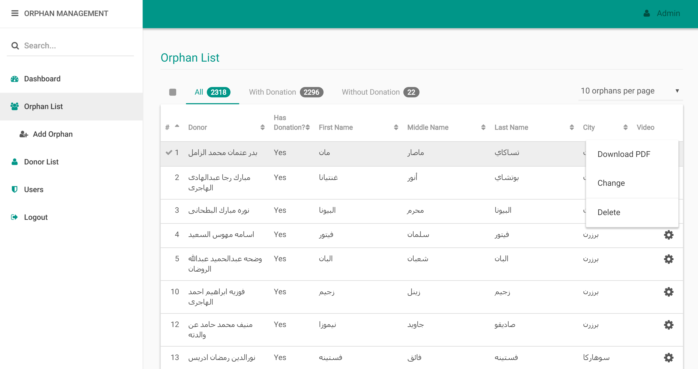

# Orphan Management System


Offers the possibility of managing orphans and donors, downloading reports and more

It's built using Laravel for the backend, and Vue.js for most of the front end, also some other Javascript frameworks like Dropzone.JS and Cropper.JS

### Installation

After cloning to your machine, run
```composer install``` and ```npm install``` from the terminal.

After that, you can modify the migrations the way they suit your project, and after that, run ```php artisan migrate```



Puntoria Inc. 2018
